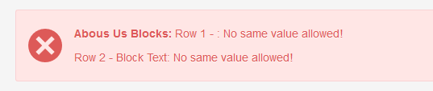
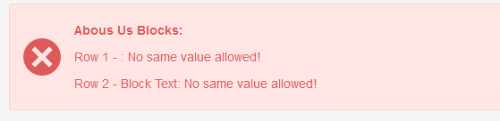

## ALIGNED ALERT

Adds ` ` after alert's label to keep display of validation errors each on separate line and not messy.

Also check this PR: https://github.com/CouchCMS/CouchCMS/pull/115

## Example

Before &mdash;

After &mdash;

## Support

See dedicated [**SUPPORT**](/SUPPORT.md) page.

