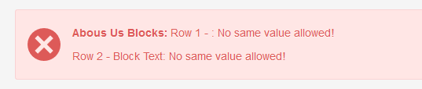

## ALIGNED ALERT

Adds ` ` after alert's label to keep display of validation errors each on separate line and not messy.

This code comes from `"couch/addons/anton.cms@ya.ru__admin-panel-tweaks/alert-aligned"`

More details in CouchCMS's GitHub: https://github.com/CouchCMS/CouchCMS/pull/115

## Example

Before &mdash;

After &mdash;

## Support

Donations are desperately welcomed to keep up with support requests; to continue receiving your [thankyou's](https://github.com/trendoman/Dignotas) &mdash;

**Bitcoin**: bc1qsl2tulmsjcvpkegepeunmumz599yz0lhuktdjt

Ask any question via forum or email &mdash; <anton.cms@ya.ru>, <tony.smirnov@gmail.com> &mdash; Anton S aka Trendoman 
You'll get *a good meaningful* reply within hours.

My CouchCMS forum posts: https://www.couchcms.com/forum/search.php?author_id=18478&sr=posts

New Telegram channel: https://t.me/couchcms
