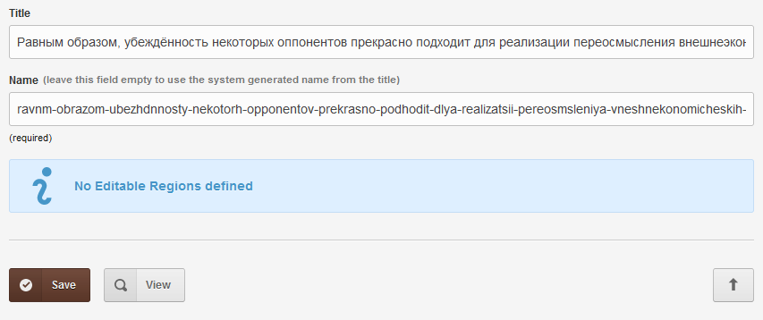

# Cyrillic letters transliteration

Usually it is a requirement and very useful to convert cyrillic-only titles of cloned pages into a translit version to be used in page names/urls.

## Example

## Installation

Everything described in the dedicated [**INSTALL**](/INSTALL.md) page applies.

Remove the ~ (tilde) from the path to enable tweak.

## Support

See dedicated [**SUPPORT**](/SUPPORT.md) page.
