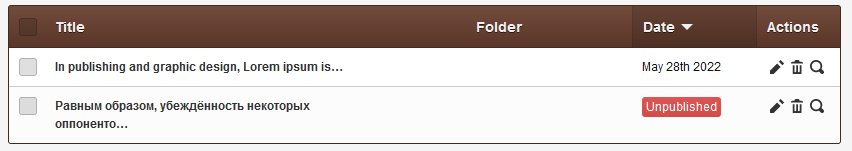
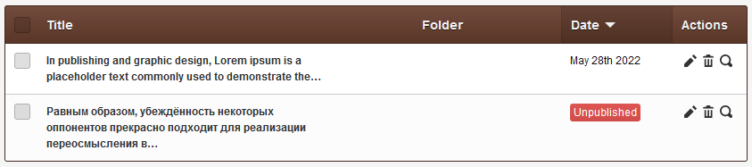

# Title's length

Increase page's title visible length in list-view before ellipsis (...) kicks in.

## Example

Normal is 48 &mdash;



**With this mod**: Can be tweaked to any number, say 100 &mdash;



Most importantly, the mod **applies globally**, to all template at once, saving you a lot of time!

## Support

Donations are desperately welcomed to keep up with support requests; to continue receiving your [thankyou's](https://github.com/trendoman/Dignotas) &mdash;

**Bitcoin**: bc1qsl2tulmsjcvpkegepeunmumz599yz0lhuktdjt

Ask any question via forum or email &mdash; <anton.cms@ya.ru>, <tony.smirnov@gmail.com> &mdash; Anton S aka Trendoman<br>
You'll get *a good meaningful* reply within hours.

My CouchCMS forum posts: https://www.couchcms.com/forum/search.php?author_id=18478&sr=posts

New Telegram channel: https://t.me/couchcms

---

```txt
@link     https://www.couchcms.com/forum/viewtopic.php?f=2&t=10250#p24782
@author   Kamran Kashif aka KK <kksidd@couchcms.com>
@date     11.06.2019
```
