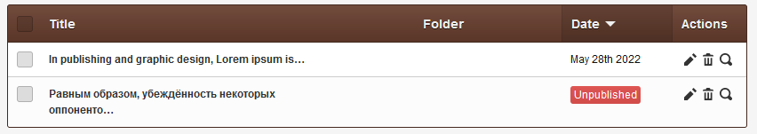
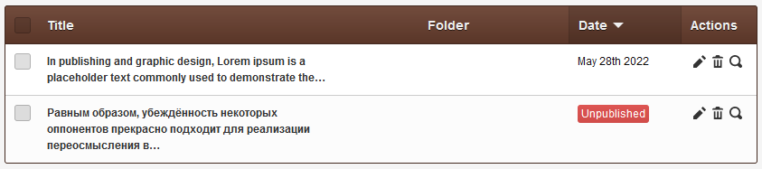

# Title's length

Increase page's title visible length in list-view before ellipsis (...) kicks in.

## Example

Normal is 48 &mdash;

**With this mod**: Can be tweaked to any number, say 100 &mdash;

Most importantly, the mod **applies globally**, to all template at once, saving you a lot of time!

## Support

See dedicated [**SUPPORT**](/SUPPORT.md) page.
