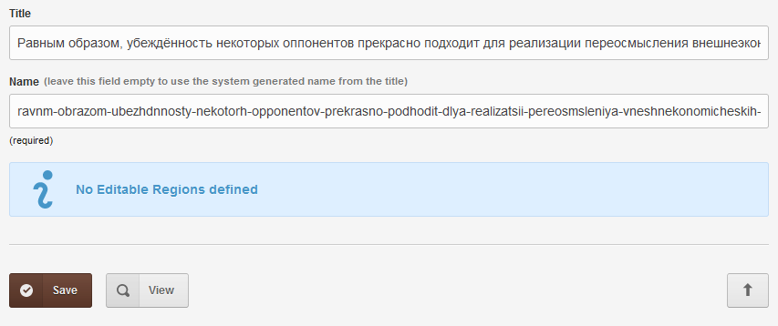

# Cyrillic letters transliteration

Usually it is a requirement and very useful to convert cyrillic-only titles of cloned pages into a translit version to be used in page names/urls.

## Example



## Support

Donations are desperately welcomed to keep up with support requests; to continue receiving your [thankyou's](https://github.com/trendoman/Dignotas) &mdash;

**Bitcoin**: bc1qsl2tulmsjcvpkegepeunmumz599yz0lhuktdjt

Ask any question via forum or email &mdash; <anton.cms@ya.ru>, <tony.smirnov@gmail.com> &mdash; Anton S aka Trendoman<br>
You'll get *a good meaningful* reply within hours.

My CouchCMS forum posts: https://www.couchcms.com/forum/search.php?author_id=18478&sr=posts

New Telegram channel: https://t.me/couchcms

---

```txt
@link   https://www.couchcms.com/forum/viewtopic.php?f=8&t=7916#p20364
@author Musman  https://www.couchcms.com/forum/memberlist.php?mode=viewprofile&u=18329
@author Kamran Kashif aka KK <kksidd@couchcms.com>
@author Anton Smirnov aka Trendoman <tony.smirnov@gmail.com>
@date   28.06.2019
@last   25.05.2022
```
