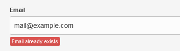

# no_duplicate_mail

Validator shows error if the entered email is already in the database.

It is attached to any "email" field and throws Error on the editable field.



## Parameters

Change parameters directly in the `no_duplicate_mail.php` &mdash;

* replace *contacts.php* with the template that stores emails
* edit the name of the email field *user_email* on the left side of the double parenthesis in *custom_field='user_email==..'*

## Usage

Definition includes the **validator** parameter.

```html
<cms:editable name='user_email' label='Email' validator='email | no_duplicate_mail' type='text' order='-1'/>
```

## Installation

Everything described in the dedicated [**INSTALL**](/INSTALL.md) page applies.

Remove the ~ (tilde) from the path to enable validator.

## Support

Check out my dedicated [**SUPPORT**](/SUPPORT.md) page.
