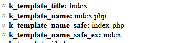

# New variable: `k_template_name_safe`

Quickly access **safe** name of current template via &ndash;
- `k_template_name_safe` variable, or, without extension
- `k_template_name_safe_ex`

## Example
```html
<cms:test
    ignore='0'
    >
  <cms:dump_all />

</cms:test>
```
HTML:



## Support

Donations are desperately welcomed to keep up with support requests; to continue receiving your [thankyou's](https://github.com/trendoman/Dignotas) &mdash;

**Bitcoin**: bc1qsl2tulmsjcvpkegepeunmumz599yz0lhuktdjt

Ask any question via forum or email &mdash; <anton.cms@ya.ru>, <tony.smirnov@gmail.com> &mdash; Anton S aka Trendoman<br>
You'll get *a good meaningful* reply within hours.

My CouchCMS forum posts: https://www.couchcms.com/forum/search.php?author_id=18478&sr=posts

New Telegram channel: https://t.me/couchcms

---

```txt
@author Anton S aka Trendoman <tony.smirnov@gmail.com>
@date   11.06.2019
```
