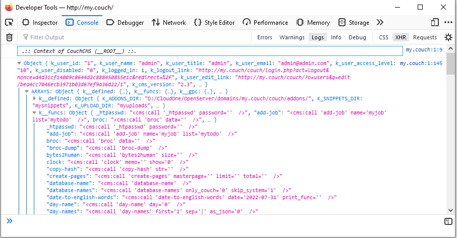

# k__funcs

Adds a new variable ***k__funcs*** to the global context. It contains all func signatures of available to CouchCMS funcs.

It is very easy to know what your function expects without looking into README.

## Example

List signatures –

```xml
<ol>
  <cms:each k__funcs>
  <li><code><cms:html_encode><cms:show item /></cms:html_encode></code></li>
  </cms:each>
</ol>
```

Listing HTML output will include the sample calls to the funcs with all parameters filled *(example)* —

```html
<cms:call 'random-name' length='8' set='abcdefghijklmnopqrstuvwxyz0123456789' />
```

It is much more convenient to use the **[broc-dump](#related-funcs)** function to quickly peek into the variable in the browser console.



Output of the tag `<cms:dump_all/>` displays this variable before the user-defined variables with value *Array*:

`k__funcs: Array`

## Related funcs

* **[CmsFu » broc-dump](https://github.com/trendoman/Cms-Fu/tree/master/Logs/broc-dump)**

## Installation

Everything described in the dedicated [**INSTALL**](/INSTALL.md) page applies.

## Support

See dedicated [**SUPPORT**](/SUPPORT.md) page.
