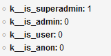

# k__is_*

Adds new variables to the global context about the current user.

* k__is_superadmin
* k__is_admin
* k__is_user
* k__is_anon

Values of these variables can be either *1* or *0*. It depends on who's logged in or, in case of **k__is_anon**, not logged in.

> Notation `k__` with double underscore is used to distinguish custom variables from native `k_` variables.<br>
> Name starts with `k__` because such variables can not be overridden accidentally with tags `<cms:set>`, `<cms:put>`.

## Example

Helps make a quick check &mdash;
```html
<cms:if k__is_superadmin>Welcome!</cms:if>
```
or
```html
<cms:if k__is_anon>Please log in.</cms:if>
```

### dump

Variables are set in global scope so are visible with dump &mdash;
```html
<cms:test
    ignore='0'
    >
  <cms:dump_all />
</cms:test>
```

### result



## Support

See dedicated [**SUPPORT**](/SUPPORT.md) page.

