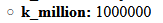

# k__million

Adds a new variable `k__million` to the global context. It contains a number `1000000`.

It helps **not count zeroes** when a big limit needs to be set in some tag like *cms:pages* where default limit is always as low as *1000*.

> Notation `k__` with double underscore is used to distinguish custom variables from native `k_` variables.<br>
> Name starts with `k__` because such variables can not be overridden accidentally with tags `<cms:set>`, `<cms:put>`.


## Example

```html
<cms:pages masterpage='orders.php' limit=k__million return_sql='1' />
```

### dump

Variable is set in global scope so is visible with dump &mdash;

```html
<cms:test
    ignore='0'
    >
  <cms:dump_all />
</cms:test>
```

### result



## Support

See dedicated [**SUPPORT**](/SUPPORT.md) page.

