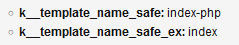

# k__template_name_safe

Quickly access a safe name of current template via `k__template_name_safe` variable and its sister-var `k__template_name_safe_ex` (same, but without extension).

## Example

Let's see the 'dump' with code placed in 'index.php' template –

```xml
<cms:test
    ignore='0'
    >
  <cms:dump_all />
</cms:test>
```

Output of 'dump' shows variables in global context –



## Installation

Everything described in the dedicated [**INSTALL**](/INSTALL.md) page applies.

## Support

See dedicated [**SUPPORT**](/SUPPORT.md) page.
