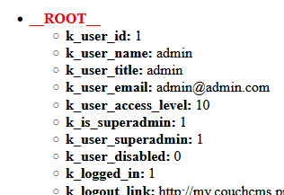

# k_is_superadmin, k_user_superadmin

Adds new identical variables to the global context in case **SuperAdmin** is logged in.
* `k_is_superadmin`
* `k_user_superadmin`

Helps make a quick check &mdash;
```html
<cms:if k_user_superadmin>...</cms:if>
```
or
```html
<cms:if k_is_superadmin>...</cms:if>
```
## Example
```html
<cms:test
    ignore='0'
    >
  <cms:dump_all />

</cms:test>
```
HTML (SuperAdmin is logged in):



## Support

See dedicated [**SUPPORT**](/SUPPORT.md) page.

