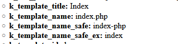

# k_template_name_safe

Quickly access **safe** name of current template via the new variable.
* `k_template_name_safe` and, without extension, &ndash;
* `k_template_name_safe_ex`

## Example
```html
<cms:test
    ignore='0'
    >
  <cms:dump_all />

</cms:test>
```
HTML:




## Support

See dedicated [**SUPPORT**](/SUPPORT.md) page.
